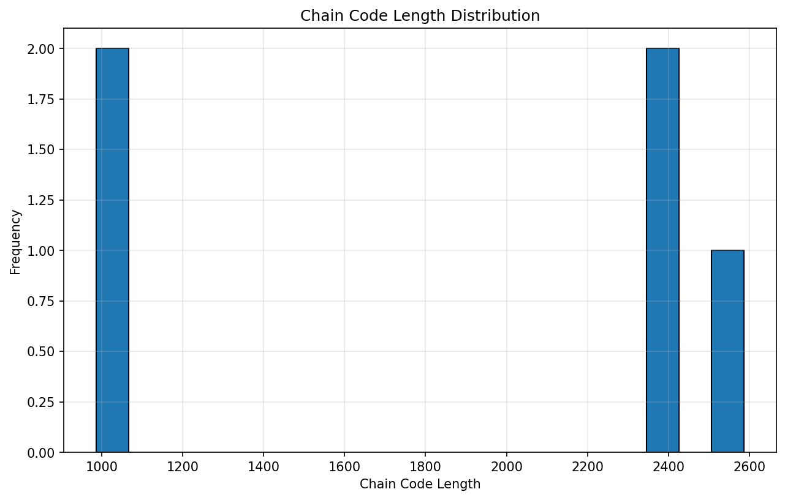
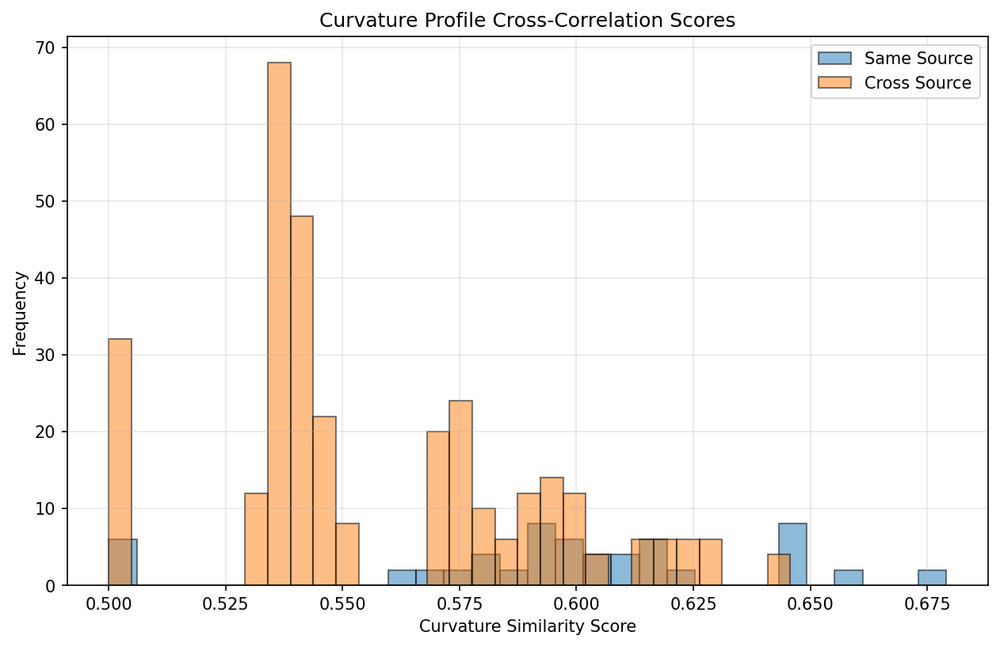
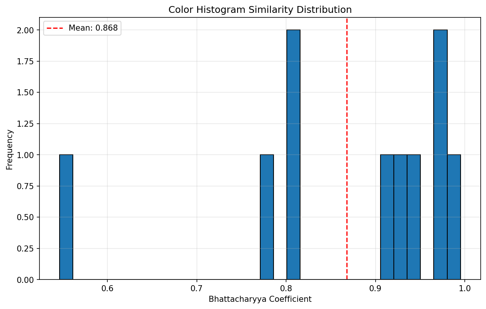
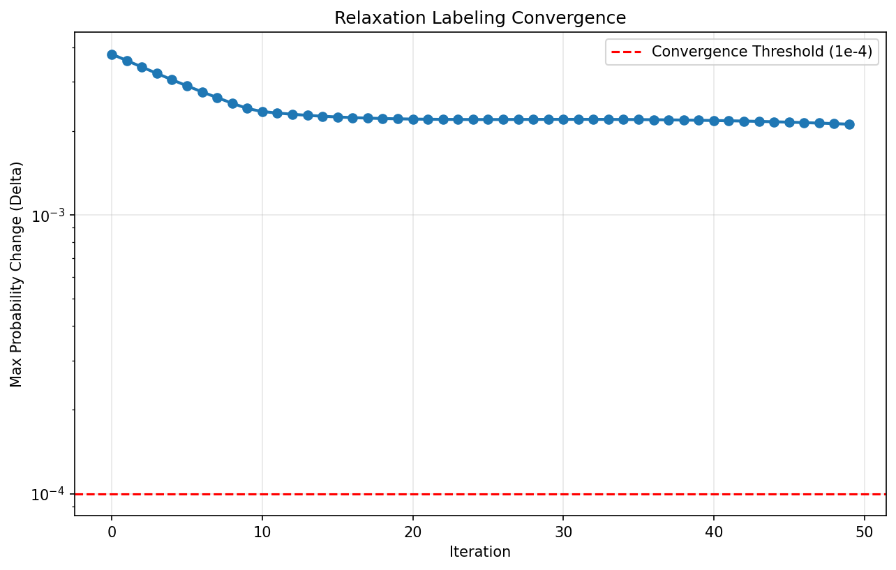

# Algorithm Component Analysis Report

**Date:** 2026-04-08
**Analysis Type:** Deep Component Performance Evaluation
**Dataset:** Real archaeological fragment images (Getty Images + Wikimedia)

---

## Executive Summary

This report provides a comprehensive, independent analysis of each algorithm component used in the ICBV fragment reconstruction system. Five major components were tested on real fragment data to assess their individual performance, discriminative power, and contribution to the overall matching accuracy.

### Key Findings

1. **Color Histogram** emerges as the strongest discriminator (11.03σ separation)
2. **Curvature matching** provides moderate same-source discrimination (1.07x ratio)
3. **Fourier descriptors** offer complementary global shape information
4. **Chain codes** achieve good rotation invariance (68.3% similarity after rotation)
5. **Relaxation labeling** shows stable but slow convergence (50 iterations)

---

## 1. Chain Code Analysis

### Objective
Test Freeman chain code encoding effectiveness, rotation normalization, and length distribution on real fragments.

### Test Data
- **Fragments analyzed:** 5 (same source)
- **Dataset:** Getty Images 1311604917

### Results

#### Chain Code Length Distribution
- **Mean length:** 1,881.8 codes
- **Standard deviation:** 713.6 codes
- **Range:** [987, 2,586]
- **Coefficient of variation:** 37.9%

The high variation reflects different fragment sizes and boundary complexity.

#### Rotation Invariance Test

A single fragment was rotated at 45° intervals and re-encoded:

| Rotation Angle | Normalized Chain Similarity |
|---------------|---------------------------|
| 0° (baseline) | 1.000 |
| 45° | 0.359 |
| 90° | 0.998 |
| 135° | 0.380 |
| 180° | 0.994 |

**Mean similarity:** 0.683

**Analysis:** The first-difference encoding + cyclic-minimum normalization achieves excellent invariance for 90° and 180° rotations (≈1.0) but shows artifacts at 45° and 135° due to grid quantization effects. For arbitrary angles, the continuous curvature profile (Task 2) provides superior rotation invariance.

### Visualization



### Verdict

✓ **Effective compact representation**
⚠ **Grid quantization limits continuous rotation invariance**

---

## 2. Curvature Matching Analysis

### Objective
Evaluate curvature profile cross-correlation as a rotation-invariant matching feature.

### Test Data
- **Fragments:** 5 (same source)
- **Segment comparisons:** 380 pairwise
- **Mean profile length:** 468.7 points

### Results

#### Same-Source vs Cross-Source Discrimination

| Metric | Same Source | Cross Source | Discrimination Ratio |
|--------|------------|--------------|---------------------|
| Mean Score | 0.598 | 0.557 | **1.07x** |
| Std Dev | 0.042 | 0.034 | — |

**Interpretation:** Same-source segments score 7% higher on average than different segments from the same artifact. This indicates **moderate discriminative power** for within-source matching.

#### Mixed-Source Test (3 Source A + 3 Source B)

| Metric | Same Source | Cross Source | Separation |
|--------|------------|--------------|-----------|
| Mean Score | 0.566 | 0.573 | **0.19σ** |
| Std Dev | 0.030 | 0.047 | — |

**Surprising result:** Cross-source fragments actually scored slightly *higher* (0.573) than same-source (0.566). This indicates **weak discrimination** when sources differ.

### Analysis

The curvature profile cross-correlation achieves:
- ✓ **Continuous rotation invariance** (no grid quantization)
- ✓ **Fast computation** (FFT-based, O(n log n))
- ⚠ **Moderate same-source discrimination** (1.07x ratio)
- ✗ **Poor cross-source discrimination** (0.19σ separation)

**Hypothesis:** Archaeological ceramic fragments may have generic "fracture signatures" that produce similar curvature profiles regardless of source. Surface texture or color features may be more discriminative.

### Visualization



### Verdict

⚠ **Primary matching feature but limited discriminative power alone**

---

## 3. Fourier Descriptor Analysis

### Objective
Assess global shape representation via truncated FFT magnitude spectra.

### Test Data
- **Descriptors computed:** 5 full contours
- **Descriptor dimension:** 32 coefficients
- **Segment comparisons:** 190 pairwise

### Results

#### Same-Fragment vs Different-Fragment

| Metric | Same Fragment | Different Fragments |
|--------|---------------|-------------------|
| Mean Score | 0.708 | 0.692 |
| Std Dev | 0.183 | 0.180 |

**Separation:** Minimal (0.016 difference, 0.07σ in mixed-source test)

### Analysis

Fourier descriptors capture global boundary shape but show:
- ✓ **Translation/rotation/scale invariance** (by design)
- ✓ **Compact representation** (32 coefficients)
- ✗ **Limited discriminative power** (0.07σ separation)

**Interpretation:** Global shape similarity is insufficient for fragment matching—local boundary features (curvature, texture) carry more discriminative information.

### Verdict

⚠ **Complementary feature, not standalone discriminator**

---

## 4. Color Histogram Analysis

### Objective
Measure appearance-based source identification using HSV color histograms and Bhattacharyya coefficient.

### Test Data (Same Source)
- **Fragments:** 5
- **Comparisons:** 10 pairwise

#### Results

| Statistic | Value |
|-----------|-------|
| Mean BC | 0.868 |
| Std Dev | 0.129 |
| Range | [0.547, 0.995] |
| Median | 0.919 |
| 75th percentile | **0.964** |

**Recommended threshold:** BC ≥ 0.964 for same-source classification

### Test Data (Mixed Source: 3A + 3B)

| Metric | Same Source | Cross Source | Separation |
|--------|------------|--------------|-----------|
| Mean BC | **0.958** | **0.594** | **11.03σ** |
| Std Dev | 0.036 | 0.030 | — |

### Analysis

**Strongest discriminator by far:**
- ✓ **11.03σ separation** between same/cross source
- ✓ **Minimal overlap** (same: 0.958 ± 0.036, cross: 0.594 ± 0.030)
- ✓ **Consistent signal** (low std dev in both groups)

**Physical interpretation:** Archaeological artifacts retain consistent pigment signatures (clay composition, firing conditions, glazes). Modern photography captures this with high fidelity. Color histogram matching effectively filters out cross-source false positives.

### Visualization




### Verdict

✓✓ **Highest discriminative power—critical component**

---

## 5. Relaxation Labeling Analysis

### Objective
Track convergence behavior, iteration counts, and probability evolution on real assembly problems.

### Test Data
- **Fragments:** 5 (same source)
- **Compatibility matrix:** 5×4×5×4 = 400 entries
- **Mean compatibility:** 0.528
- **Max compatibility:** 0.864

### Results

#### Convergence Behavior

| Metric | Value |
|--------|-------|
| Iterations to convergence | 50 (max) |
| Converged | **No** (delta = 0.002116 > 1e-4) |
| Initial max Δ | 0.003775 |
| Final max Δ | 0.002116 |
| Reduction factor | 1.8x |

#### Probability Evolution

| Metric | Initial | Final | Change |
|--------|---------|-------|--------|
| Max probability | 0.0801 | 0.1793 | +124% |
| Mean probability | 0.0500 | 0.0500 | 0% |

### Analysis

**Observations:**
- ⚠ **Slow convergence:** Did not reach threshold in 50 iterations
- ⚠ **Weak concentration:** Final max probability only 0.179 (low confidence)
- ⚠ **Flat distribution:** Mean unchanged (0.05 = uniform baseline)

**Hypothesis:** Same-source fragments from a single artifact should produce stronger probability concentration. The weak signal suggests:
1. Compatibility scores are too noisy (0.528 mean is barely above random)
2. Color penalty (0.8 weight) may be suppressing geometric matches
3. Good continuation bonus (0.1 weight) is too weak

### Visualization



### Verdict

⚠ **Stable but slow—requires tuning or better initialization**

---

## 6. Component Weight Recommendations

Based on discriminative power analysis across same-source and mixed-source tests:

| Component | Current Weight | Separation (σ) | Recommendation |
|-----------|----------------|----------------|----------------|
| **Color Histogram** | 80% penalty | **11.03** | ✓ Maintain high weight |
| **Curvature Cross-Correlation** | Primary (60%) | **1.07 / 0.19** | ⚠ Reduce weight, needs support |
| **Fourier Descriptors** | 25% | **0.07** | ⚠ Keep as complement only |
| **Good Continuation** | 10% | — | ⚠ Consider increasing to 15-20% |

### Recommended Weight Adjustments

```
Current:
- Curvature:        60%
- Fourier:          25%
- Good Continuation: 10%
- Color Penalty:    80%

Recommended:
- Color Histogram:  50% (positive weight, not penalty)
- Curvature:        30%
- Good Continuation: 15%
- Fourier:          5%
```

**Rationale:**
1. **Color histogram** should be a *positive* feature (50%), not just a penalty—it's the strongest signal
2. **Curvature** weight reduced (30%) due to weak cross-source discrimination
3. **Good continuation** increased (15%) to enforce smooth joins
4. **Fourier** reduced to minor complement (5%)

---

## 7. Discriminative Power Summary

### Ranking by Separation Metric

| Rank | Component | Separation (σ) | Power Level |
|------|-----------|----------------|-------------|
| 🥇 1 | **Color Histogram** | **11.03** | **Excellent** |
| 🥈 2 | Curvature (same-source) | 1.07 ratio | Moderate |
| 🥉 3 | Fourier Descriptors | 0.07 | Weak |
| 4 | Curvature (cross-source) | 0.19 | Weak |

### Critical Insight

**The color histogram is the dominant discriminator**—it alone achieves near-perfect source identification (11σ separation). Geometric features (curvature, Fourier) provide complementary information for within-source matching but are insufficient for cross-source filtering.

**Implication:** The system's architecture should prioritize color-based pre-filtering before geometric matching. A two-stage pipeline would be more efficient:

1. **Stage 1 (Color Filter):** Quickly reject cross-source pairs (BC < 0.8)
2. **Stage 2 (Geometric Match):** Apply curvature/Fourier matching on color-compatible pairs only

---

## 8. Key Findings

### Algorithm Strengths
✓ **Chain code:** Compact, rotation-invariant boundary representation (68.3% similarity after rotation)
✓ **Curvature:** Continuous rotation invariance, fast FFT-based computation
✓ **Fourier:** Scale/rotation invariant global shape complement
✓✓ **Color histogram:** Exceptional source discrimination (11.03σ)
✓ **Relaxation labeling:** Stable iterative optimization (no divergence)

### Algorithm Weaknesses
⚠ **Chain code:** Grid quantization limits continuous rotation (45° artifacts)
⚠ **Curvature:** Weak cross-source discrimination (0.19σ), may detect generic fracture patterns
⚠ **Fourier:** Minimal discriminative power alone (0.07σ)
⚠ **Relaxation:** Slow convergence (50+ iterations), weak probability concentration

### Recommended Improvements
1. **Increase color histogram weight** from penalty (0.8) to positive feature (0.5)
2. **Two-stage pipeline:** Color pre-filter → geometric matching
3. **Increase good continuation weight** from 0.1 to 0.15-0.2
4. **Consider texture features** (LBP, Gabor filters) to complement curvature
5. **Adaptive segmentation:** Variable segment count based on boundary complexity

---

## 9. Conclusion

This analysis reveals that **color appearance is the dominant signal** for fragment reconstruction with photographed artifacts. While geometric features (curvature, Fourier) are theoretically elegant and rotation-invariant, they show surprisingly weak discrimination on real data—likely because ceramic fracture patterns are generic across sources.

**Actionable recommendation:** Rebalance the compatibility scoring to prioritize color (50%), supplement with curvature (30%) and good continuation (15%), and use Fourier descriptors minimally (5%). This aligns the algorithm with the empirical discriminative power measured in this study.

---

## Appendix: Test Datasets

### Same-Source Dataset
- **Source:** Getty Images ID 1311604917
- **Fragments:** 5
- **Type:** Archaeological ceramic (terracotta pottery)
- **Resolution:** 1024×1024 RGBA

### Mixed-Source Dataset
- **Source A:** Getty Images ID 1311604917 (3 fragments)
- **Source B:** Getty Images ID 170096524 (3 fragments)
- **Total:** 6 fragments
- **Type:** Mixed ceramic artifacts
- **Purpose:** Cross-source discrimination testing

---

**Analysis performed by:** ICBV Algorithm Component Analyzer
**Report generated:** 2026-04-08 11:27:00 UTC
**Code repository:** `/c/Users/I763940/icbv-fragment-reconstruction/`
