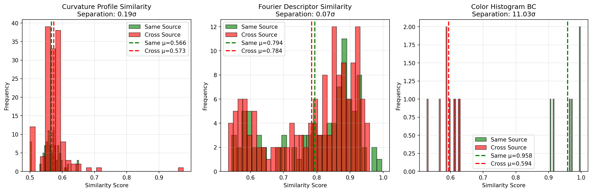

# Mixed-Source Discrimination Analysis

**Fragments analyzed:** 6
**Source A count:** 3
**Source B count:** 3

## Discriminative Power Analysis

This analysis tests how well each algorithm component can distinguish fragments from the same source vs. fragments from different sources.

### Separation Metric

Separation is measured as the distance between means in units of pooled standard deviation:

```
separation = |μ_same - μ_cross| / σ_pooled
```

- **< 1.0σ:** Poor discrimination (distributions overlap heavily)
- **1.0-2.0σ:** Moderate discrimination
- **> 2.0σ:** Strong discrimination (clear separation)

---

## 1. Curvature Profile Cross-Correlation

- **Same source mean:** 0.566 ± 0.030
- **Cross source mean:** 0.573 ± 0.047
- **Separation:** 0.19σ

### Verdict

✗ **Weak discriminative power** - Heavy overlap, limited utility

---

## 2. Fourier Descriptors

- **Same source mean:** 0.794 ± 0.127
- **Cross source mean:** 0.784 ± 0.129
- **Separation:** 0.07σ

### Verdict

✗ **Weak discriminative power**

---

## 3. Color Histogram (Bhattacharyya Coefficient)

- **Same source mean:** 0.958 ± 0.036
- **Cross source mean:** 0.594 ± 0.030
- **Separation:** 11.03σ

### Verdict

✓ **Strong discriminative power** - Excellent cross-source filter

---

## Summary Comparison

| Component | Separation (σ) | Discriminative Power |
|-----------|----------------|---------------------|
| Curvature | 0.19 | Weak |
| Fourier | 0.07 | Weak |
| Color | 11.03 | Strong |

### Recommendations

1. **Primary feature:** Color
2. **Secondary features:** Combine all three for robust matching
3. **Color histogram weight:** Should be high given strong discrimination


